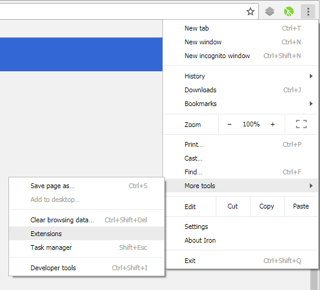
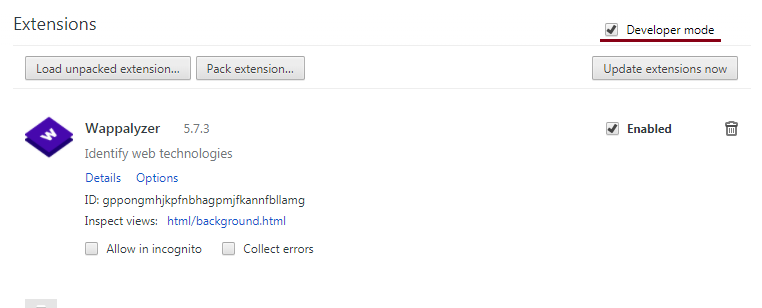
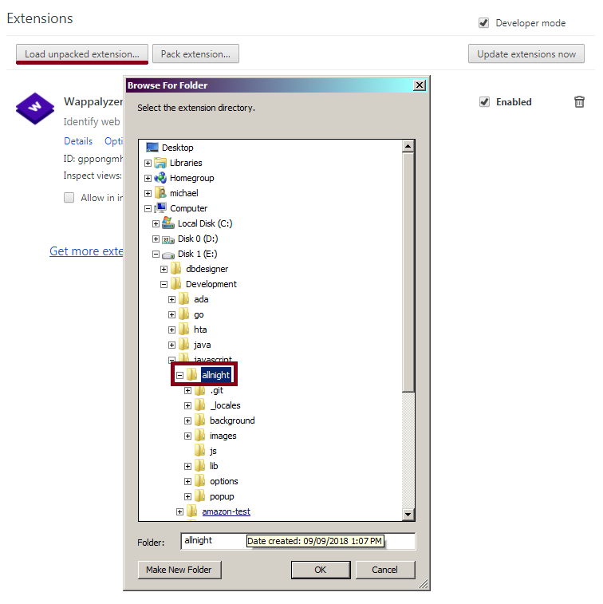

# AllNight

A chrome extension for creating twitch.tv playlists. Written using AngularJS.

### Disclaimer

This repo is unfinished and probably doesn't function very well anymore. I never updated it, and I'm sure twitch's api
has changed significantly.

### Installation

 1. Open the extensions configuration page in Chrome

     

 2. Turn on "Developer Mode"

     

 3. "Load Unpacked Extension" and select the allnight folder

     
     
